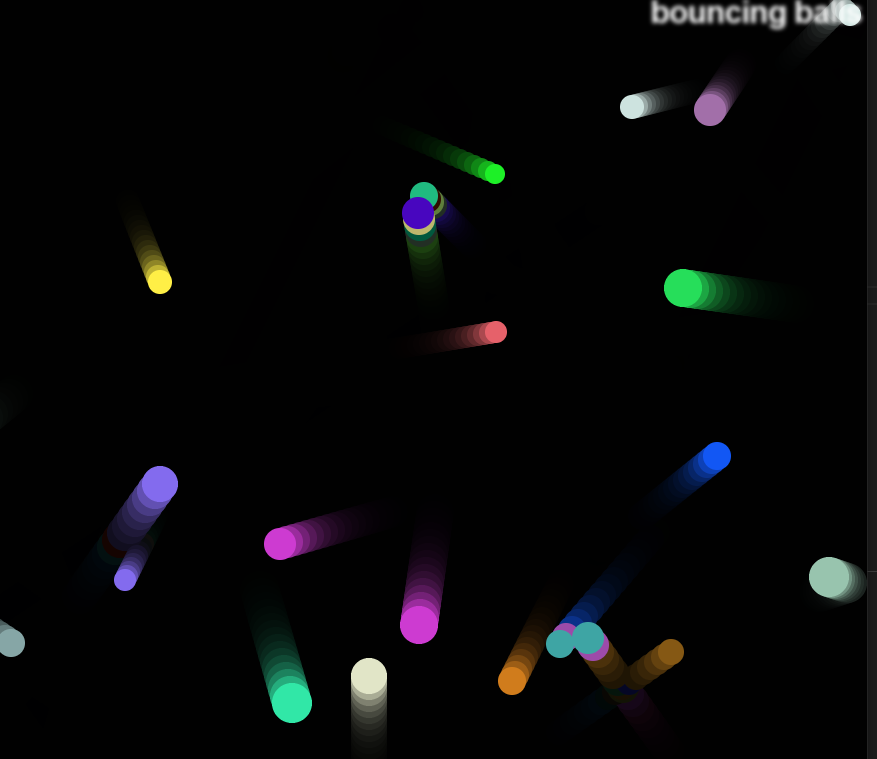

  

<h3 align="center">Bouncing Balls</h3>

---

 Bouncing Balls on a canvas.
      

## 🧐 About 

A project using object oriented javascript to generate random colored balls that bounce around a screen.
Animation is basic so it gives some interesting effects when balls collide.
A slight opacity on the color pallet gives the trail effect after each ball.

Here's the final look.

## ⛏️ Built Using 

- built with the help of an MDN project workshop.

## 🎉 Acknowledgements 

- Hat tip to anyone whose code was used
- Inspiration - a fun project applying collision code
